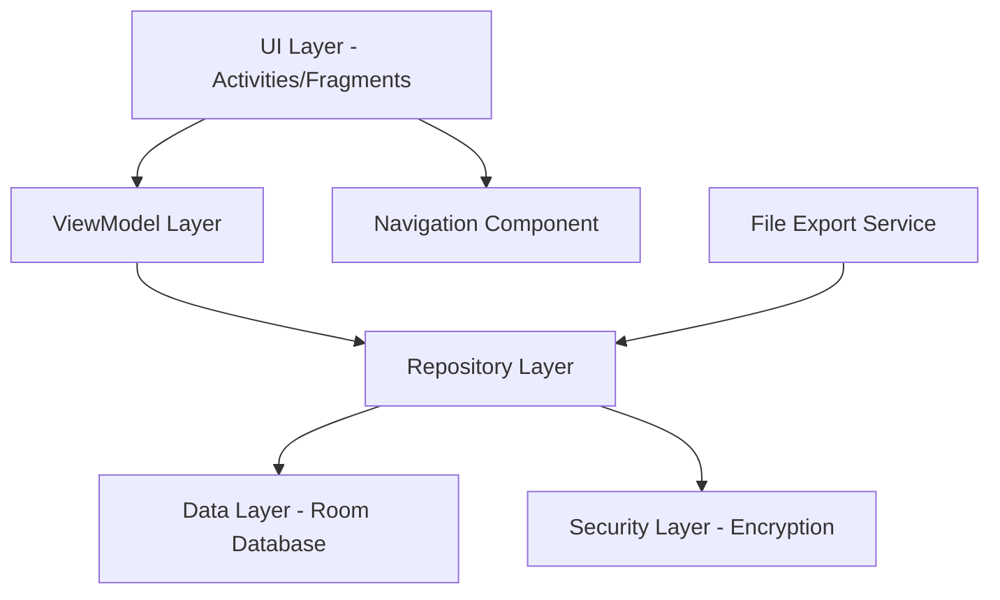
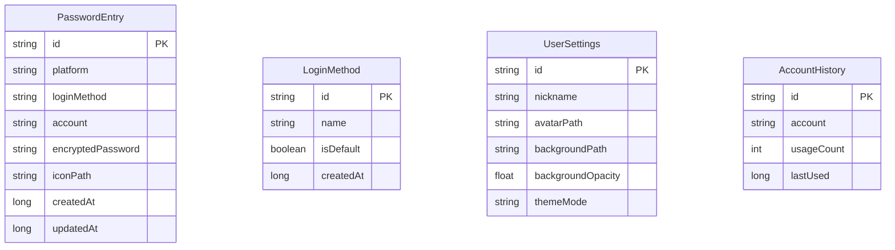

# 设计文档

## 概述

密码管理应用采用现代Android开发架构，使用Material Design 3设计语言，实现安全、美观、易用的密码管理功能。应用基于MVVM架构模式，使用Room数据库进行本地数据存储，采用Navigation Component实现页面导航。

## 架构

### 整体架构



### 技术栈

- **UI框架**: Android Jetpack + Material Design 3
- **架构模式**: MVVM (Model-View-ViewModel)
- **数据库**: Room Database
- **导航**: Navigation Component
- **依赖注入**: Hilt (可选)
- **加密**: Android Keystore + AES加密
- **动画**: Material Motion + Lottie
- **图标**: Font Awesome或Material Icons

## 组件和接口

### 1. 主要Activity

#### MainActivity
- 承载底部导航栏和Fragment容器
- 管理全局主题和背景设置
- 处理应用级别的生命周期

```kotlin
class MainActivity : AppCompatActivity() {
    private lateinit var binding: ActivityMainBinding
    private lateinit var navController: NavController
    
    // 底部导航栏设置
    // 自定义背景管理
    // 主题切换
}
```

### 2. 核心Fragment

#### RecordFragment (记录页面)
- 密码记录表单
- 平台图标自动匹配
- 登录方式管理
- 账号智能建议

#### SearchFragment (查询页面)
- 搜索框和过滤器
- 密码列表展示
- 详情弹窗

#### ProfileFragment (我的页面)
- 用户信息展示
- 功能菜单列表
- 设置入口

### 3. 数据模型

#### PasswordEntry (密码条目)
```kotlin
@Entity(tableName = "password_entries")
data class PasswordEntry(
    @PrimaryKey val id: String = UUID.randomUUID().toString(),
    val platform: String,
    val loginMethod: String,
    val account: String,
    val encryptedPassword: String,
    val iconPath: String? = null,
    val createdAt: Long = System.currentTimeMillis(),
    val updatedAt: Long = System.currentTimeMillis()
)
```

#### LoginMethod (登录方式)
```kotlin
@Entity(tableName = "login_methods")
data class LoginMethod(
    @PrimaryKey val id: String = UUID.randomUUID().toString(),
    val name: String,
    val isDefault: Boolean = false,
    val createdAt: Long = System.currentTimeMillis()
)
```

#### UserSettings (用户设置)
```kotlin
@Entity(tableName = "user_settings")
data class UserSettings(
    @PrimaryKey val id: String = "user_settings",
    val nickname: String = "",
    val avatarPath: String? = null,
    val backgroundPath: String? = null,
    val backgroundOpacity: Float = 0.3f,
    val themeMode: String = "light"
)
```

### 4. Repository层

#### PasswordRepository
```kotlin
class PasswordRepository @Inject constructor(
    private val passwordDao: PasswordDao,
    private val encryptionService: EncryptionService
) {
    suspend fun savePassword(entry: PasswordEntry): Result<Unit>
    suspend fun getAllPasswords(): Flow<List<PasswordEntry>>
    suspend fun searchPasswords(query: String): Flow<List<PasswordEntry>>
    suspend fun deletePassword(id: String): Result<Unit>
}
```

### 5. 安全服务

#### EncryptionService
```kotlin
class EncryptionService {
    fun encrypt(plainText: String): String
    fun decrypt(encryptedText: String): String
    fun generateKey(): SecretKey
}
```

## 数据模型

### 数据库设计



### 文件存储结构

```
/data/data/com.example.passwordmanager/
├── databases/
│   └── password_manager.db
├── files/
│   ├── icons/
│   │   ├── platform_icons/
│   │   └── custom_icons/
│   ├── backgrounds/
│   └── exports/
└── shared_prefs/
    └── app_preferences.xml
```

## 错误处理

### 错误类型定义

```kotlin
sealed class AppError : Exception() {
    object NetworkError : AppError()
    object DatabaseError : AppError()
    object EncryptionError : AppError()
    object FileAccessError : AppError()
    data class ValidationError(val field: String) : AppError()
}
```

### 错误处理策略

1. **数据库错误**: 显示友好提示，提供重试选项
2. **加密错误**: 记录日志，引导用户重新设置
3. **文件访问错误**: 检查权限，提供权限申请引导
4. **验证错误**: 实时表单验证，高亮错误字段

## 测试策略

### 单元测试

- **Repository层测试**: 数据操作逻辑
- **ViewModel测试**: 业务逻辑和状态管理
- **加密服务测试**: 加密解密功能
- **工具类测试**: 验证、格式化等工具方法

### 集成测试

- **数据库测试**: Room数据库操作
- **文件操作测试**: 导入导出功能
- **权限测试**: 相册访问、文件读写权限

### UI测试

- **导航测试**: 页面跳转和返回
- **表单测试**: 输入验证和提交
- **列表测试**: 搜索和筛选功能
- **动画测试**: 过渡动画和交互反馈

## UI设计规范

### 色彩系统

```kotlin
// 主色调 - 浅蓝色系
val Primary = Color(0xFF6750A4)
val OnPrimary = Color(0xFFFFFFFF)
val PrimaryContainer = Color(0xFFEADDFF)
val OnPrimaryContainer = Color(0xFF21005D)

// 次要色调 - 浅绿色系
val Secondary = Color(0xFF625B71)
val OnSecondary = Color(0xFFFFFFFF)
val SecondaryContainer = Color(0xFFE8DEF8)
val OnSecondaryContainer = Color(0xFF1D192B)

// 背景色
val Background = Color(0xFFFFFBFE)
val OnBackground = Color(0xFF1C1B1F)
val Surface = Color(0xFFFFFBFE)
val OnSurface = Color(0xFF1C1B1F)

// 功能色块
val PasswordCard = Color(0xFFE3F2FD)    // 密码卡片 - 浅蓝
val PlatformCard = Color(0xFFE8F5E8)    // 平台卡片 - 浅绿
val AccountCard = Color(0xFFFFF3E0)     // 账号卡片 - 浅橙
val SettingCard = Color(0xFFF3E5F5)     // 设置卡片 - 浅紫
```

### 圆角规范

```kotlin
val CornerRadius = object {
    val Small = 8.dp      // 小组件
    val Medium = 12.dp    // 卡片
    val Large = 16.dp     // 大卡片
    val ExtraLarge = 24.dp // 弹窗
}
```

### 动画规范

```kotlin
val AnimationDuration = object {
    val Fast = 150L       // 快速反馈
    val Normal = 300L     // 标准动画
    val Slow = 500L       // 页面切换
}

val AnimationEasing = object {
    val Standard = FastOutSlowInEasing
    val Emphasized = CubicBezierEasing(0.2f, 0.0f, 0.0f, 1.0f)
}
```

### 字体规范

```kotlin
val Typography = Typography(
    displayLarge = TextStyle(
        fontSize = 57.sp,
        lineHeight = 64.sp,
        fontWeight = FontWeight.Normal
    ),
    headlineMedium = TextStyle(
        fontSize = 28.sp,
        lineHeight = 36.sp,
        fontWeight = FontWeight.Normal
    ),
    titleLarge = TextStyle(
        fontSize = 22.sp,
        lineHeight = 28.sp,
        fontWeight = FontWeight.Normal
    ),
    bodyLarge = TextStyle(
        fontSize = 16.sp,
        lineHeight = 24.sp,
        fontWeight = FontWeight.Normal
    )
)
```

## 页面布局设计

### 1. 记录页面布局

```xml
<!-- 垂直滚动布局 -->
<ScrollView>
    <LinearLayout orientation="vertical">
        <!-- 页面标题 -->
        <TextView style="@style/HeadlineMedium" />
        
        <!-- 平台信息卡片 -->
        <MaterialCardView style="@style/PlatformCard">
            <!-- 平台名称输入 -->
            <TextInputLayout>
                <TextInputEditText hint="平台名称" />
            </TextInputLayout>
            
            <!-- 平台图标选择 -->
            <ImageView id="platformIcon" />
        </MaterialCardView>
        
        <!-- 登录信息卡片 -->
        <MaterialCardView style="@style/AccountCard">
            <!-- 登录方式选择 -->
            <AutoCompleteTextView hint="登录方式" />
            
            <!-- 绑定账号输入 -->
            <TextInputLayout>
                <TextInputEditText hint="绑定账号" />
            </TextInputLayout>
        </MaterialCardView>
        
        <!-- 密码信息卡片 -->
        <MaterialCardView style="@style/PasswordCard">
            <!-- 密码输入 -->
            <TextInputLayout>
                <TextInputEditText 
                    hint="密码"
                    inputType="textPassword" />
            </TextInputLayout>
            
            <!-- 密码强度指示器 -->
            <ProgressBar style="@style/PasswordStrength" />
        </MaterialCardView>
        
        <!-- 保存按钮 -->
        <Button style="@style/PrimaryButton" />
    </LinearLayout>
</ScrollView>
```

### 2. 查询页面布局

```xml
<LinearLayout orientation="vertical">
    <!-- 搜索栏 -->
    <MaterialCardView style="@style/SearchCard">
        <TextInputLayout>
            <TextInputEditText 
                hint="搜索平台、账号..."
                drawableStart="@drawable/ic_search" />
        </TextInputLayout>
    </MaterialCardView>
    
    <!-- 筛选标签 -->
    <HorizontalScrollView>
        <LinearLayout orientation="horizontal">
            <Chip text="全部" />
            <Chip text="常用" />
            <Chip text="最近添加" />
        </LinearLayout>
    </HorizontalScrollView>
    
    <!-- 密码列表 -->
    <RecyclerView 
        id="passwordList"
        layoutManager="LinearLayoutManager" />
</LinearLayout>
```

### 密码列表项布局

```xml
<!-- 密码条目卡片 -->
<MaterialCardView style="@style/PasswordItemCard">
    <LinearLayout orientation="horizontal">
        <!-- 平台图标 -->
        <ImageView 
            id="platformIcon"
            style="@style/PlatformIcon" />
        
        <LinearLayout 
            orientation="vertical"
            layout_weight="1">
            <!-- 平台名称 -->
            <TextView 
                id="platformName"
                style="@style/TitleMedium" />
            
            <!-- 账号信息 -->
            <TextView 
                id="accountInfo"
                style="@style/BodyMedium" />
            
            <!-- 密码显示区域 -->
            <LinearLayout orientation="horizontal">
                <TextView 
                    id="passwordDisplay"
                    text="●●●●●●●●"
                    style="@style/PasswordText"
                    android:clickable="true"
                    android:focusable="true" />
                
                <ImageView 
                    id="visibilityToggle"
                    src="@drawable/ic_visibility_off"
                    style="@style/VisibilityIcon" />
            </LinearLayout>
        </LinearLayout>
        
        <!-- 更多操作按钮 -->
        <ImageView 
            id="moreActions"
            src="@drawable/ic_more_vert"
            style="@style/ActionIcon" />
    </LinearLayout>
</MaterialCardView>
```

### 3. 我的页面布局

```xml
<ScrollView>
    <LinearLayout orientation="vertical">
        <!-- 用户信息卡片 -->
        <MaterialCardView style="@style/UserInfoCard">
            <ImageView id="userAvatar" />
            <TextView id="userNickname" />
        </MaterialCardView>
        
        <!-- 功能菜单 -->
        <LinearLayout orientation="vertical">
            <!-- 导出功能 -->
            <MaterialCardView style="@style/SettingCard">
                <LinearLayout orientation="horizontal">
                    <ImageView src="@drawable/ic_export" />
                    <TextView text="导出密码本" />
                    <ImageView src="@drawable/ic_arrow_right" />
                </LinearLayout>
            </MaterialCardView>
            
            <!-- 自定义背景 -->
            <MaterialCardView style="@style/SettingCard">
                <LinearLayout orientation="horizontal">
                    <ImageView src="@drawable/ic_background" />
                    <TextView text="自定义背景" />
                    <ImageView src="@drawable/ic_arrow_right" />
                </LinearLayout>
            </MaterialCardView>
            
            <!-- 其他设置项... -->
        </LinearLayout>
    </LinearLayout>
</ScrollView>
```

## 关键功能实现

### 1. 密码安全显示和交互

```kotlin
class PasswordViewHolder(private val binding: ItemPasswordBinding) : RecyclerView.ViewHolder(binding.root) {
    private var isPasswordVisible = false
    private val passwordDisplayManager = PasswordDisplayManager()
    
    fun bind(passwordEntry: PasswordEntry) {
        binding.apply {
            platformName.text = passwordEntry.platform
            accountInfo.text = passwordEntry.account
            
            // 默认显示掩码密码
            passwordDisplay.text = passwordEntry.getMaskedPassword()
            visibilityToggle.setImageResource(R.drawable.ic_visibility_off)
            
            // 点击切换密码可见性
            passwordDisplay.setOnClickListener {
                togglePasswordVisibility(passwordEntry)
            }
            
            visibilityToggle.setOnClickListener {
                togglePasswordVisibility(passwordEntry)
            }
        }
    }
    
    private fun togglePasswordVisibility(passwordEntry: PasswordEntry) {
        if (isPasswordVisible) {
            // 隐藏密码
            binding.passwordDisplay.text = passwordEntry.getMaskedPassword()
            binding.visibilityToggle.setImageResource(R.drawable.ic_visibility_off)
            binding.passwordDisplay.setOnLongClickListener(null)
            isPasswordVisible = false
        } else {
            // 显示密码
            val decryptedPassword = encryptionService.decrypt(passwordEntry.encryptedPassword)
            binding.passwordDisplay.text = decryptedPassword
            binding.visibilityToggle.setImageResource(R.drawable.ic_visibility)
            
            // 设置长按复制功能
            binding.passwordDisplay.setOnLongClickListener {
                copyPasswordToClipboard(decryptedPassword)
                showCopySuccessMessage()
                true
            }
            isPasswordVisible = true
        }
    }
    
    private fun copyPasswordToClipboard(password: String) {
        val clipboard = itemView.context.getSystemService(Context.CLIPBOARD_SERVICE) as ClipboardManager
        val clip = ClipData.newPlainText("password", password)
        clipboard.setPrimaryClip(clip)
        
        // 安全考虑：5秒后清空剪贴板
        Handler(Looper.getMainLooper()).postDelayed({
            clipboard.setPrimaryClip(ClipData.newPlainText("", ""))
        }, 5000)
    }
    
    private fun showCopySuccessMessage() {
        Toast.makeText(itemView.context, "密码已复制到剪贴板", Toast.LENGTH_SHORT).show()
    }
}
```

### 2. 平台图标自动匹配

```kotlin
class PlatformIconMatcher {
    private val iconMap = mapOf(
        "微信" to R.drawable.ic_wechat,
        "QQ" to R.drawable.ic_qq,
        "支付宝" to R.drawable.ic_alipay,
        "淘宝" to R.drawable.ic_taobao,
        // ... 更多平台映射
    )
    
    fun matchIcon(platformName: String): Int? {
        return iconMap[platformName] ?: findSimilarIcon(platformName)
    }
}
```

### 3. 智能账号建议

```kotlin
class AccountSuggestionProvider {
    suspend fun getSuggestions(input: String): List<String> {
        return accountHistoryDao.getFrequentAccounts(input)
            .sortedByDescending { it.usageCount }
            .map { it.account }
    }
}
```

### 4. 密码安全管理

```kotlin
class PasswordSecurityManager {
    
    // 密码强度检测
    fun checkPasswordStrength(password: String): PasswordStrength {
        var score = 0
        
        if (password.length >= 8) score++
        if (password.any { it.isUpperCase() }) score++
        if (password.any { it.isLowerCase() }) score++
        if (password.any { it.isDigit() }) score++
        if (password.any { "!@#$%^&*()_+-=[]{}|;:,.<>?".contains(it) }) score++
        
        return when (score) {
            0, 1 -> PasswordStrength.WEAK
            2, 3 -> PasswordStrength.MEDIUM
            4, 5 -> PasswordStrength.STRONG
        }
    }
    
    // 防止截屏录屏
    fun enableScreenSecurity(activity: Activity) {
        activity.window.setFlags(
            WindowManager.LayoutParams.FLAG_SECURE,
            WindowManager.LayoutParams.FLAG_SECURE
        )
    }
    
    // 应用进入后台时隐藏敏感内容
    fun hideContentInBackground(activity: Activity) {
        activity.window.setFlags(
            WindowManager.LayoutParams.FLAG_SECURE,
            WindowManager.LayoutParams.FLAG_SECURE
        )
    }
}

enum class PasswordStrength {
    WEAK, MEDIUM, STRONG
}
```

### 5. 自定义背景处理

```kotlin
class BackgroundManager {
    fun setCustomBackground(imageUri: Uri, opacity: Float) {
        val bitmap = loadAndResizeBitmap(imageUri)
        val processedBitmap = applyOpacity(bitmap, opacity)
        saveBackgroundImage(processedBitmap)
        updateUserSettings(backgroundPath, opacity)
    }
    
    private fun applyOpacity(bitmap: Bitmap, opacity: Float): Bitmap {
        // 应用透明度处理，确保不影响内容可读性
        val paint = Paint().apply {
            alpha = (opacity * 255).toInt()
        }
        val canvas = Canvas(bitmap)
        canvas.drawBitmap(bitmap, 0f, 0f, paint)
        return bitmap
    }
}
```

## 安全设计原则

### 密码存储安全

1. **加密存储**: 所有密码使用AES-256加密后存储，密钥存放在Android Keystore中
2. **内存安全**: 密码明文仅在必要时短暂存在于内存中，使用后立即清零
3. **传输安全**: 密码在应用内部传输时始终保持加密状态

### 用户界面安全

1. **默认隐藏**: 密码默认以掩码形式显示（●●●●●●●●）
2. **主动显示**: 用户点击后才显示明文密码
3. **自动隐藏**: 显示明文密码后，用户再次点击或离开页面时自动隐藏
4. **长按复制**: 仅在密码可见状态下支持长按复制功能
5. **剪贴板清理**: 复制后5秒自动清空剪贴板内容

### 应用级安全

1. **防截屏**: 启用FLAG_SECURE防止截屏和录屏
2. **后台隐藏**: 应用进入后台时隐藏敏感内容
3. **生物识别**: 支持指纹/面部识别解锁应用
4. **会话超时**: 长时间不使用自动锁定应用

这个设计文档涵盖了应用的整体架构、数据模型、UI设计规范和关键功能实现方案，为后续的开发提供了详细的技术指导。